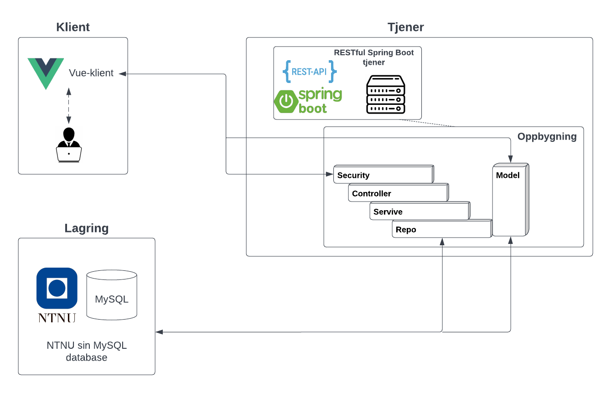

Klienten (presentasjonslaget) er bygget som en single page application (SPA) i Vue.js som sender HTTP-forespørsler til REST endepunkter på serversiden. På logikklaget mottar så serveren forespørselen, håndterer autentisering og gjør en oppgave. Videre kan serveren hente data fra datalaget/databasen.

