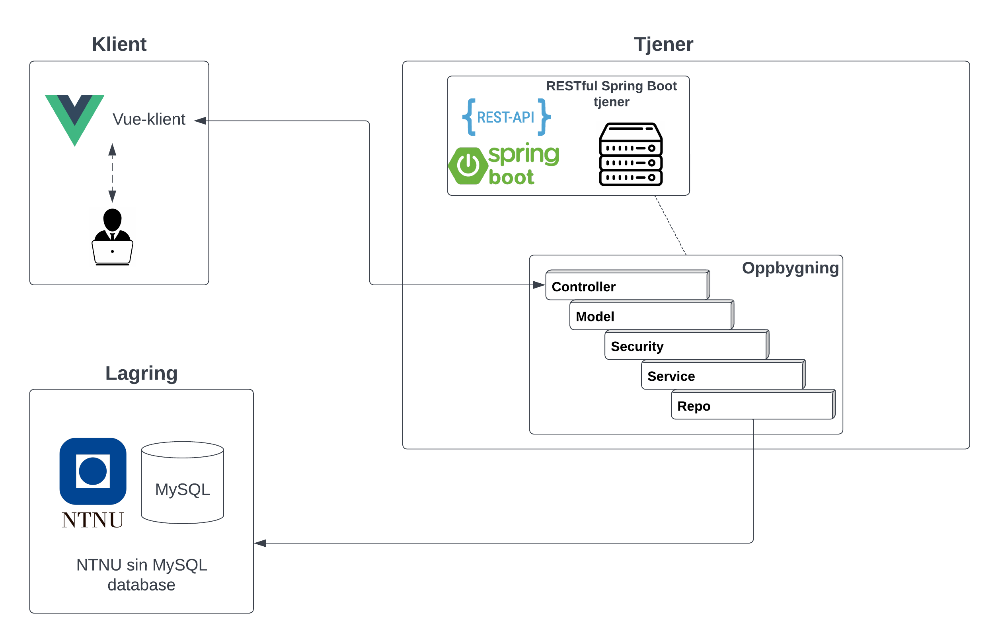

**!! Midlertidig bildefigur med overblikk over systemarkitekturen**

[Link til Lucidchart-diagram](https://lucid.app/lucidchart/0d99b432-a250-4c3c-82a4-24b8ca16d577/edit?beaconFlowId=CD065968ADA5F066&invitationId=inv_61a89027-4702-489d-96cd-8c8816df58c9&page=0_0#)

## Klient
Klienten i dette prosjektet er en vue basert javascript klient. Klienten burker axios sitt bibliotek for rest forespørseler for å kommunisere med tjenesten. Forespørreslene varier om de bruker JSON objekter eller query og path variabler for komunikasjon.

## Tjener
Tjeneren er bygget på Spring boot som er ett bibliotek for rest APIer. Tjeneren støtter Open authentication med JWT tokens for sikkerhet. APIet støtter mange forskjellige endepunkter og har en rekke funksjoner for å returne data i forskjellige modeller. APIet komuniserer kan kommunisere både med en H2 in memory database, eller en mySQL database. 

## Lagring
Hvis tjeneren er satt opp for å kommuniser med mySQl, kobles apiet opp mot en database i NTNUs mySQL server. Databasen sikkrer persistens for lagring av brukere, produkter, utleieavtaler og anmeldelser. I H2 profilen kobles tjeneren opp mot en h2 in memory database. Denne databasen er hovedsakelig for testing siden den ikke støtter persistens