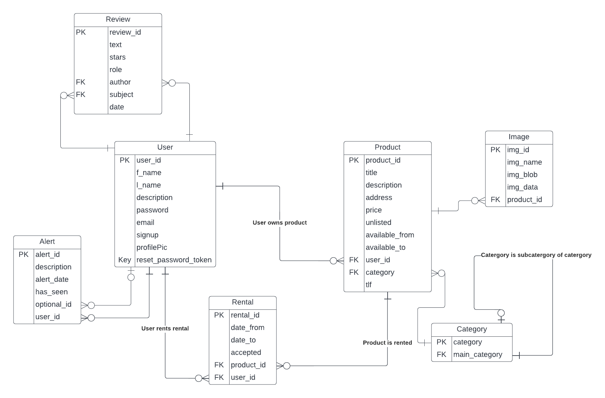

## Relasjonsmodell

## Komponenter

Databasen består av 8 hovedkomponenter, uten noen sammenkoblingstabeller.

De forskjellige tabellene er:

1. **User**  
   Inneholder data om brukerne.
2. **Produkt**  
   Lagrer info om produkter.
3. **Images**  
   Bilder som tilhører produkter. 
4. **Category**  
   Kategorier lagret hierarkisk gjennom nøsting
5. **Rentals**  
   Leieavtaler og hvorvidt de her blitt akseptert eller ikke
6. **Alerts**  
   Lagrer varslingene. Dette er alle varslinger om leieavtaler, forespørsler, osv.
7. **Reviews**   
   Brukerenes anmeldelser (både som leier og utleier).
  

#### Variabler
