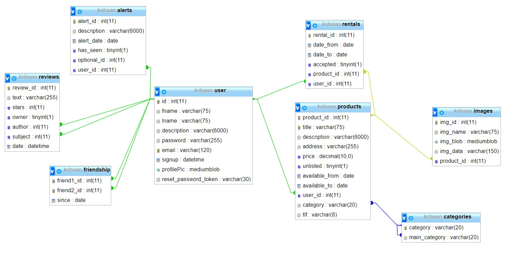

### Database diagram
Relasjons modell

Variabel typer

Databasen består av 8 hovedkomponenter, uten noen sammenkoblingstabeller.

De forskjellige tabellene er:
1. User  
  Lagrer info relevant for en gitt bruker.
2. Produkt  
  Lagrer info relevant for ett gitt produkt.
3. Images  
  Lagrer bilder som hører til diverse produkter. 
4. Category  
  Lagrer kategorier og nøster dem hierarkisk
5. Rentals  
  Lagrer leie avtaler og hvorvidt de er akseptert
6. Alerts  
  Lagrer varsler, varsler kan handle om mye, som leieavtale akseptert, leie forespørsler og lignende.
7. Reviews  
  Lagrer anmeldelser om brukere. Kan både handle om en som leier og en som leier ut, dette kan markeres ved owner true/false.
8. Friendship  
  Lagrer vennskap mellom bruker. 
  