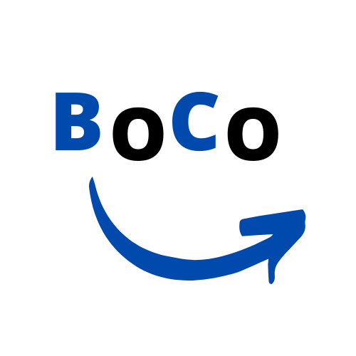

___

## Om programmet
BoCo (Borrow Community) er et norsk selskap som vil tilby en plattform for utlån av gjenstander for privatpersoner og bedrifter. Målet er å bli den foretrukne plattformen for lån for privatpersoner og bedrifter i Norge. 

Vi legger hovedvekt på at BoCo skal eksistere gjennom BoCo-appen, som skal være BoCos ansikt utad. Gjennom plattformen vår ønsker vi å legge til rette for mer bærekraftige samfunn.

Vi retter oss inn mot privatpersoner og bedrifter. Vi vet at det finnes privatpersoner som innehar gjenstander som andre har bruk for i en kortere tidsperiode. For eksempel kan det være at man har behov for en høytrykkspyler når man skal vaske terrassen på våren, men ikke ønsker eller har råd til å kjøpe en egen. Da er det bedre for lommeboka og miljøet om man kan låne av en som allerede har det, og som ønsker å låne det ut. Den som legger ut annonsen kan velge å ta betalt for utleie, eller leie ut gratis. 

_BoCo - for å skape bærekraftige samfunn_    
  

&nbsp;

&nbsp;

## Scrum-team 08
Scrum-master:
- Minh Dan Nguyen
___
Members:
- Oskar Langås Eidem
- Mats Solem Gravem
- Dominykas Mazys
- Hanna Gjone Nordhus
- Mathangi Pushparajah
- Henriette Brekke Sunde
- Joel Mattias Tømmerbakk
- Kristoffer Høiaas Aandahl

