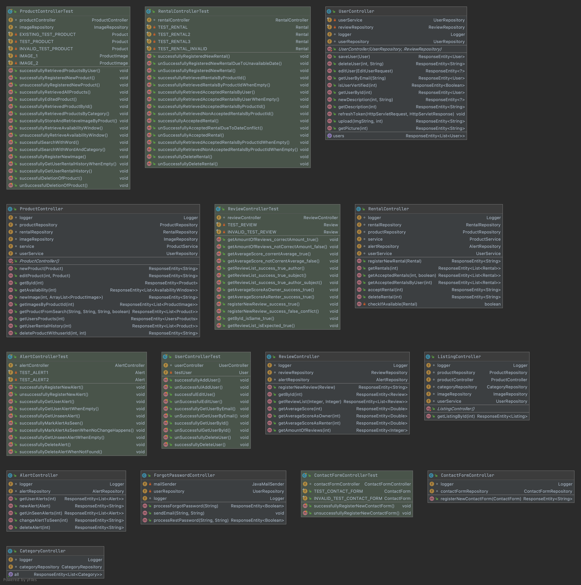
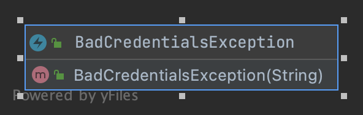
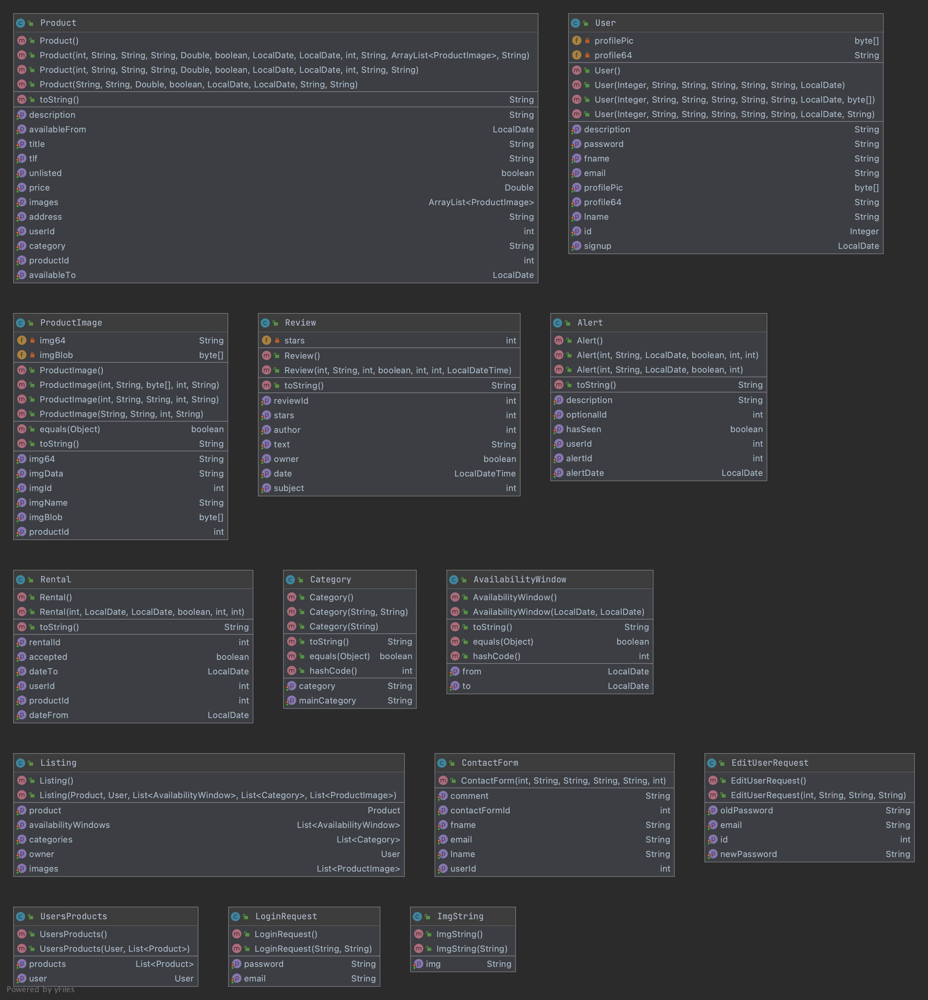
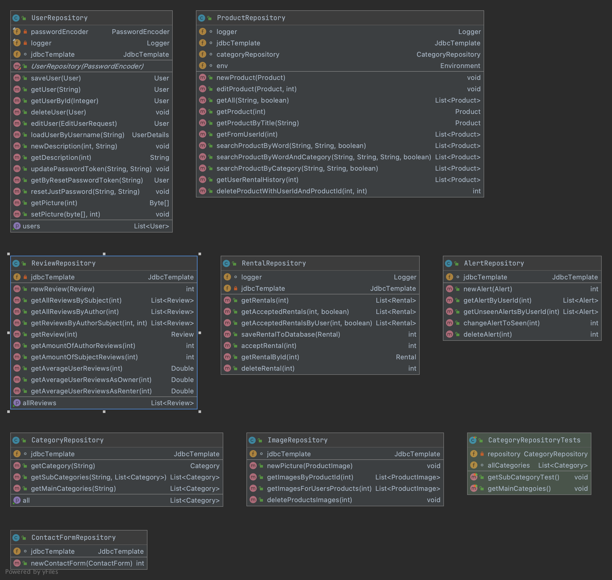
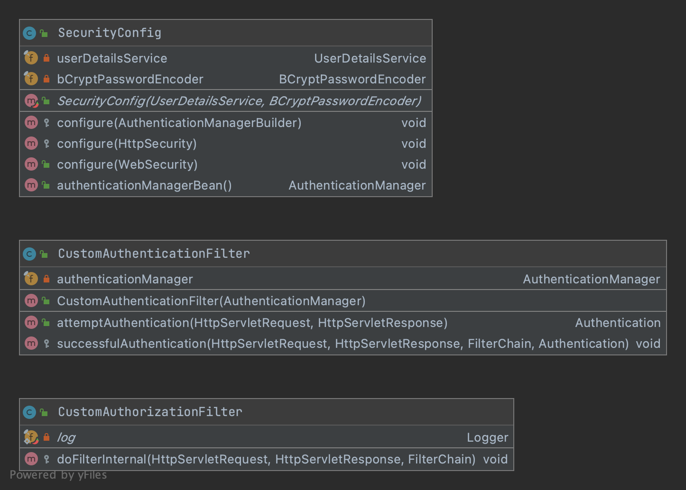
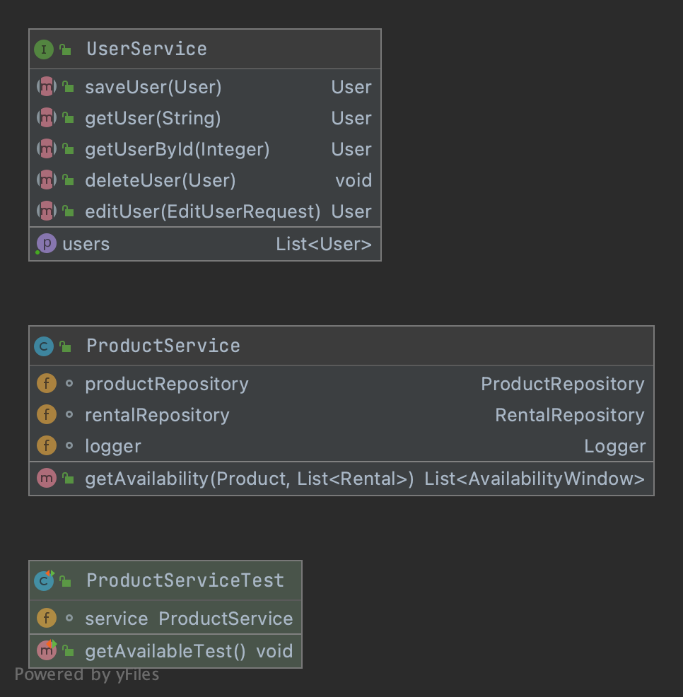
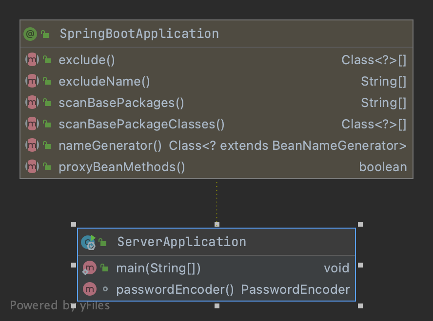

Sammenhengene mellom klassene i bildet over er generert med _**IntelliJ IDEA**_.

## Pakkene i prosjektet med tilhørende klasser, inkludert objektvariabler og metodehoder
### Controller-pakken:

### Exceptions-pakken:

### Model-pakken:

### Repository-pakken:

### Security-pakken:

### Service-pakken:

### ServerApplication:
